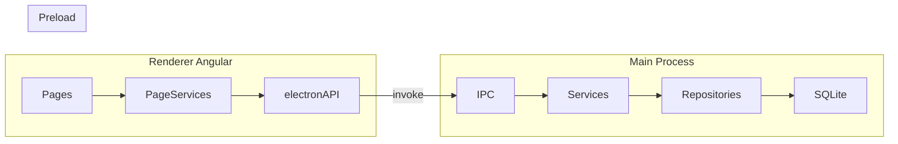
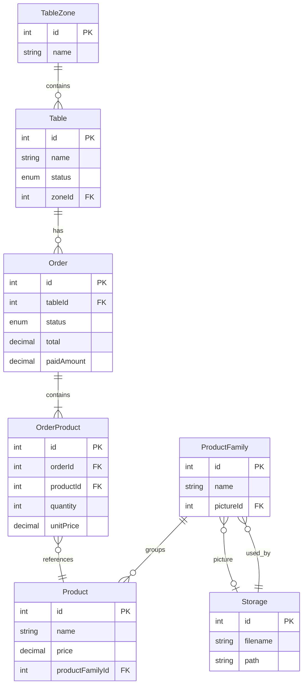
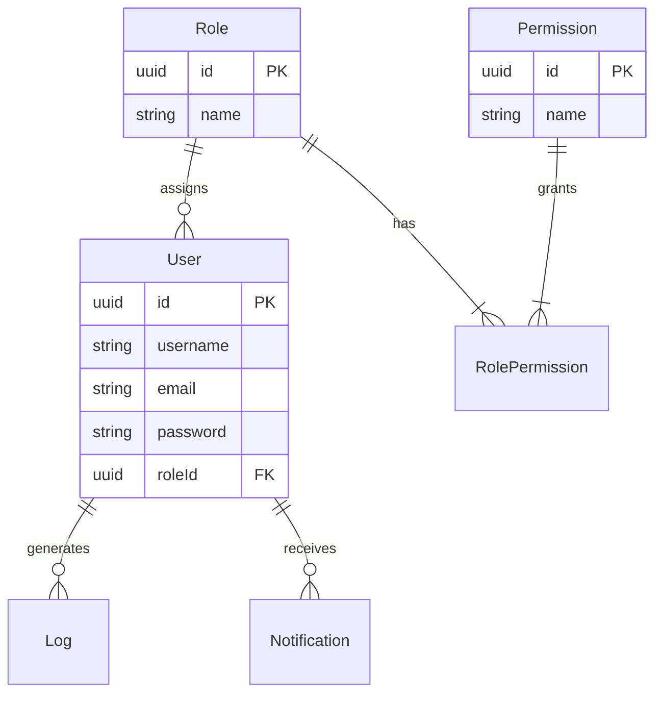

# Cashier — Project Plan

> Living document reflecting the codebase state on `dev`. Update this file as phases complete.

## 1. Vision and Scope

**Cashier** is a desktop point-of-sale (POS) application for restaurant table service. It supports zone/table management, order taking, partial and full payment, and back-office catalog administration.

### Target users

| Role | Primary screens | Needs |
|------|-----------------|-------|
| Floor staff | Caisse, Commandes, Tables | Fast order entry, payment, table status |
| Managers | Admin tools, Statistique, Utilisateurs | Catalog CRUD, reporting, user management |

### In scope (v1)

- Single-terminal desktop POS (Electron)
- SQLite local database
- Table-based and walk-in orders
- Product catalog with families and images
- Partial and full payment

### Out of scope (deferred)

- Cloud sync / multi-terminal coordination
- Online ordering integrations
- Mobile companion app

---

## 2. Architecture Reference

### Tech stack

| Layer | Technology |
|-------|------------|
| Desktop shell | Electron 40 |
| Frontend | Angular 21 (standalone components), Spartan-ng, Tailwind CSS 4 |
| State | `@ngneat/elf` + `elf-persist-state` (form DTOs, auth flag) |
| Tables / forms | `@tanstack/angular-table`, custom `datatable-builder` / `form-builder` |
| Backend (main process) | TypeORM 0.3, `better-sqlite3`, `class-validator`, bcrypt |
| IPC | `contextBridge` preload → `ipcMain.handle` |
| Tests | Vitest |

### Process flow



### Layer responsibilities

| Path | Role |
|------|------|
| `src/` | Angular renderer — pages, components, stores, guards |
| `src-electron/` | Electron main process — database, IPC handlers, business logic |
| `src-electron/modules/` | Domain modules (table, order, product, product-family) |
| `src-electron/shared/` | Cross-cutting concerns (database, storage, user-management scaffold) |
| `libs/ui/` | Spartan Helm UI primitives (sidebar, dialog, sheet, etc.) |

### Backend module pattern

Each domain follows the same structure:

```
modules/<domain>/
  entities/
  repositories/
  services/
  dtos/
  ipcs/
```

Services extend `AbstractCrudService`; repositories extend `DatabaseAbstractRepository`. Entities extend `EntityHelper` (adds `createdAt`, `updatedAt`, `deletedAt`, soft-delete support).

### Frontend patterns

- **Pages** in `src/pages/` — one feature per folder with a local `*.service.ts` wrapping `window.electronAPI`
- **IPC access** — RxJS `from(window.electronAPI!.<domain>.<action>(...))`
- **State** — Elf stores for sheet form DTOs (`createDto` / `updateDto`) and auth persistence; page data often uses `BehaviorSubject`
- **Auth** — `authGuard` checks persisted `authenticated` flag from `AuthPersistRepository`
- **Layout** — sidebar + breadcrumbs; hidden on `/login`

### Development commands

See [README.md](../README.md):

```bash
npm run electron:dev   # Angular dev server + Electron with hot-reload
npm test               # Vitest unit tests
npm run build          # Production Angular build
npm run electron       # Build Electron + Angular, run packaged locally
```

Database file location: `{userData}/cashier.db` (Electron app data directory).

---

## 3. Current Feature Matrix

### Routed pages

| Feature | Route | Backend IPC | UI | Status |
|---------|-------|-------------|-----|--------|
| Login | `/login` | None | Done | **Stub** — hardcoded `admin` / `admin` |
| Table ops view | `/zone-tables` | `table:*`, `table-zone:*`, `order:*` | Done | **Done** |
| POS order flow | `/new-client-order`, `/new-client-order/:tableId`, `/new-client-order/order/:orderId` | `order:*`, `product-family:*`, `product:*` | Done | **Done** |
| Orders list | `/orders` | `order:*` | Done | **Done** — pagination uses array length, not DB total |
| Tables (admin) | `/tables` | `table:*`, `table-zone:*` | Done | **Done** |
| Table zones (admin) | `/table-zone` | `table-zone:*` | Done | **Done** |
| Product families | `/familles` | `product-family:*`, `storage:*` | Done | **Done** — picture upload supported |
| Products | `/produits` | `product:*`, `product-family:*` | Done | **Done** — no product image field |

### Sidebar nav placeholders (no route)

Defined in `src/components/layout/data.ts`:

| Nav item | URL | Status |
|----------|-----|--------|
| Accueil | `/accueil` | Not started |
| Caisse | `/caisse` | Not started |
| Consulter Z | `/consulter-z` | Not started — purpose TBD |
| Utilisateurs | `/utilisateurs` | Not started — backend scaffold exists |
| Statistique | `/statistique` | Not started |
| Stocks | `/stocks` | Not started |
| Ngrok | `/ngrok` | Not started — purpose TBD |

### Backend-only / not wired to UI

| Area | Location | Status |
|------|----------|--------|
| User management | `src-electron/shared/abstract-user-management/` | Scaffold complete — entities, repos, services, DTOs; **not in DB init, no IPC, no UI** |
| Logger | `src-electron/shared/logger/` | Entity + service; not registered |
| Notifications | `src-electron/shared/notifications/` | Entity + service; not registered |
| Order-product IPC | `src-electron/modules/order/ipcs/order-product.ipc.ts` | Written but **not registered**; channel names collide with `order:*` |
| Storage (full API) | `src-electron/shared/storage/ipcs/storage.ipc.ts` | 14 handlers registered; preload exposes only 4 |

---

## 4. Known Bugs and Tech Debt

| Issue | Location | Impact |
|-------|----------|--------|
| `relactions` typo (should be `relations`) | `src/pages/order/order.service.ts:43` | Active-order lookup by table may not load line items |
| Order-product IPC channel collision | `src-electron/modules/order/ipcs/order-product.ipc.ts` | Uses `order:*` — would conflict if registered alongside `order.ipc.ts` |
| Auth stub | `src/pages/auth/login.component.ts` | bcrypt present in deps but login never calls IPC or DB |
| User entities missing from DB | `src-electron/shared/database/database.ts` | Role/permission/user tables never created |
| Pagination mismatch | Renderer datatables | `totalRecords` set to returned array length; server `findAllPaginated` unused |
| Preload/entity mismatch | `src-electron/preload.ts` table API | Exposes `capacity` field not present on `TableEntity` or `CreateTableDto` |
| `synchronize: true` | `src-electron/shared/database/database.ts` | Schema auto-sync — no migrations, risky for production |
| Filename typos | `create-oder-product.dto.ts`, `update-oder-productd.dto.ts`, `UpdatetableZoneDto` | Confusing naming, harder to navigate |
| Folder typo | `src/stores/table-zone-state /` | Trailing space in directory name |
| Unused enum values | `OrderStatus.CANCELLED`, `TableStatus.RESERVED` | Defined but no UI or service flow |
| Static sidebar user | `src/components/layout/data.ts` | Hardcoded `superadmin` regardless of logged-in user |
| NestJS decorators | Electron services | `@Injectable()` from `@nestjs/common` — cosmetic only, not a Nest app |
| Mixed language UI | Various pages | French toasts, English admin labels |
| Unused injection | `src/pages/order/order.component.ts` | `OrderRepository` injected but never used |

---

## 5. Phased Roadmap

### Phase 1 — Foundation Hardening (1–2 weeks)

**Goal:** Fix known bugs, align API surfaces, improve developer experience.

- [ ] Fix `relactions` → `relations` in `src/pages/order/order.service.ts`
- [ ] Resolve order-product IPC: rename channels to `order-product:*` or fold into `OrderService`; register in `main.ts` if needed
- [ ] Align preload table DTO with `TableEntity` / `CreateTableDto` (remove or add `capacity`)
- [ ] Wire `findAllPaginated` through IPC handlers and renderer datatables
- [ ] Remove dead code (unused injections, orphaned imports)
- [ ] Rename typo files (`create-oder-product.dto.ts`, etc.)
- [ ] Fix `table-zone-state ` folder trailing space
- [ ] Add dev seed script for sample zones, tables, product families, and products

**Key files:** `src-electron/main.ts`, `src-electron/preload.ts`, `src/pages/order/order.service.ts`, `src/components/datatable-builder/`

---

### Phase 2 — Authentication and Authorization (2–3 weeks)

**Goal:** Replace stub login with real user management backed by SQLite.

- [ ] Create concrete `UserEntity` extending `AbstractUserEntity`
- [ ] Register `UserEntity`, `RoleEntity`, `PermissionEntity`, `RolePermissionEntity` in `database.ts`
- [ ] Seed default roles (`Admin`, `User` from `BasicRoles` enum) and admin user with bcrypt password
- [ ] Add user/role IPC handlers (`user:*`, `role:*`) and expose via preload
- [ ] Replace hardcoded login with IPC bcrypt verification
- [ ] Add role-based route guards (extend `authGuard` or add `roleGuard`)
- [ ] Add IPC permission checks in handlers (via `identify-user.ts` utility)
- [ ] Build `/utilisateurs` admin page — user CRUD, role assignment
- [ ] Wire sidebar user display to authenticated session

**Key files:** `src-electron/shared/abstract-user-management/`, `src/pages/auth/`, `src/guards/`, `src/app/app.routes.ts`

---

### Phase 3 — Core POS Polish (2 weeks)

**Goal:** Complete order lifecycle and improve floor-staff UX.

- [ ] Order cancellation flow — set `OrderStatus.CANCELLED`, free table if applicable
- [ ] Table `RESERVED` status — visual indicator in `/zone-tables`, admin set from `/tables`
- [ ] Receipt / ticket summary — print dialog or PDF export after payment
- [ ] Walk-in order UX refinement (no-table orders, PR #7 baseline)
- [ ] Loading and error states on POS panels (families, products, cart, keypad)
- [ ] Toast consistency (pick FR or EN, apply everywhere)

**Key files:** `src/pages/order/new-client-order/`, `src/pages/table-view/`, `src-electron/modules/order/services/order.service.ts`

---

### Phase 4 — Catalog and Media (1–2 weeks)

**Goal:** Richer product catalog for POS and admin.

- [ ] Product images via storage IPC (families already support `pictureId`)
- [ ] POS product grid search and filter by name
- [ ] Bulk import/export for products (CSV)
- [ ] Product family ordering (drag-and-drop or sort field)

**Key files:** `src/pages/product/`, `src/pages/order/new-client-order/order-products/`, `src-electron/shared/storage/`

---

### Phase 5 — Operations and Reporting (3–4 weeks)

**Goal:** Manager-facing tools for daily operations.

- [ ] `/caisse` — dedicated cash register / shift view
- [ ] `/statistique` — sales by period, top products, table turnover
- [ ] `/stocks` — inventory tracking (new module: entity, service, IPC, page)
- [ ] Wire logger for audit trail (user actions, order changes)
- [ ] Wire notifications for in-app alerts
- [ ] Decide fate of `/consulter-z` and `/ngrok` — implement or remove from nav
- [ ] `/accueil` — dashboard landing page with quick links and daily summary

**Key files:** New pages under `src/pages/`, `src-electron/shared/logger/`, `src-electron/shared/notifications/`

---

### Phase 6 — Production Readiness (2–3 weeks)

**Goal:** Ship a installable, tested, secure desktop app.

- [ ] Replace `synchronize: true` with TypeORM migrations
- [ ] Electron packaging — installer (electron-builder or similar), app icon
- [ ] Code signing (platform-specific)
- [ ] E2E test: table → order → add items → partial pay → full pay → table available
- [ ] i18n strategy — French primary, English secondary (or FR-only)
- [ ] Security pass — IPC input validation, file upload size/type limits, bcrypt cost factor review
- [ ] Auto-update mechanism (optional)

**Key files:** `src-electron/shared/database/`, `package.json`, new `e2e/` directory

---

## 6. Data Model Overview

### Entity relationships



### Scaffolded but not registered



### Enums

**OrderStatus** (`src-electron/modules/order/enum/order-status.enum.ts`)

| Value | Used in UI |
|-------|------------|
| `unpaid` | Yes |
| `partially_paid` | Yes |
| `paid` | Yes |
| `cancelled` | No — defined, no flow |

**TableStatus** (`src-electron/modules/table/enums/table-status.enum.ts`)

| Value | Used in UI |
|-------|------------|
| `available` | Yes |
| `occupied` | Yes |
| `reserved` | No — defined, no flow |

**BasicRoles** (`src-electron/shared/abstract-user-management/enums/basic-roles.enum.ts`)

| Value | Notes |
|-------|-------|
| `Admin` | Seed target for default admin user |
| `User` | Default floor-staff role |

---

## 7. IPC Channel Registry

### Registered in `main.ts`

| Domain | Channels | Handler file |
|--------|----------|--------------|
| Ping | `ping` | `main.ts` |
| Table | `table:findAll`, `table:findOneById`, `table:create`, `table:update`, `table:delete` | `modules/table/ipcs/table.ipc.ts` |
| Table zone | `table-zone:findAll`, `table-zone:findOneById`, `table-zone:create`, `table-zone:update`, `table-zone:delete` | `modules/table/ipcs/table-zone.ipc.ts` |
| Order | `order:findAll`, `order:findOneById`, `order:create`, `order:update`, `order:delete`, `order:pay` | `modules/order/ipcs/order.ipc.ts` |
| Product family | `product-family:findAll`, `product-family:findOneById`, `product-family:create`, `product-family:update`, `product-family:delete` | `modules/product-family/ipcs/product-family.ipc.ts` |
| Product | `product:findAll`, `product:findOneById`, `product:create`, `product:update`, `product:delete` | `modules/product/ipcs/product.ipc.ts` |
| Storage | `storage:store`, `storage:findAll`, `storage:findOneById`, `storage:findBySlug`, `storage:loadResource`, `storage:duplicate`, `storage:expose`, `storage:hide`, `storage:confirm`, `storage:unconfirm`, `storage:findTemporary`, `storage:softDelete`, `storage:getFilePath` | `shared/storage/ipcs/storage.ipc.ts` |

### Exposed in preload (subset)

The renderer can only call handlers listed in `src-electron/preload.ts`. Storage handlers **not** exposed to renderer: `findAll`, `findBySlug`, `loadResource`, `duplicate`, `expose`, `hide`, `confirm`, `unconfirm`, `findTemporary`.

### Not registered

| Module | Channels (if registered) | Issue |
|--------|--------------------------|-------|
| Order product | Would use `order:*` (collision) | File exists at `modules/order/ipcs/order-product.ipc.ts` — rename to `order-product:*` before registering |
| User / role / permission | Not defined yet | Backend scaffold in `shared/abstract-user-management/` |
| Logger | Not defined yet | Service + entity exist |
| Notifications | Not defined yet | Service + entity exist |

### IPC naming convention

```
<domain>:<action>
```

Examples: `table:create`, `order:pay`, `product-family:findAll`, `storage:softDelete`

When adding new domains, always register in `main.ts`, expose in `preload.ts`, and add types to `src/types/electron.d.ts`.

---

## 8. Testing Strategy

### Current state

12 Vitest spec files, mostly scaffold-level:

| Area | Spec files |
|------|------------|
| App | `src/app/app.spec.ts` |
| Order / POS | 6 specs under `src/pages/order/` |
| Admin pages | `product`, `product-family`, `tables`, `table-zone` |
| Components | `datatable-builder-action-dropdown` |

### Target coverage

| Level | Focus | Priority |
|-------|-------|----------|
| Unit | Electron services (`OrderService.createFull`, `pay`, table status transitions) | High |
| Unit | Angular page services (IPC wrapper logic, DTO mapping) | Medium |
| Integration | IPC round-trip: create order → add products → pay → verify table freed | High |
| E2E | Full POS flow through Electron (Phase 6) | High |
| Component | Form builder validation, datatable pagination | Medium |

### Critical path to test

```
Login → zone-tables → select table → add products → save order → partial pay → full pay → table available
```

---

## 9. Open Questions / Decisions Needed

| Question | Options | Recommendation |
|----------|---------|----------------|
| Phase priority: auth vs POS polish? | Phase 2 first / Phase 3 first | Phase 1 first (bugs), then Phase 2 (auth blocks user management nav item) |
| `/caisse` vs `/new-client-order` | Separate flow / alias / redirect | Clarify with stakeholders — likely `/caisse` is the primary nav entry pointing to POS |
| What is `/consulter-z`? | Z-report / end-of-day / custom | Needs product owner input |
| What is `/ngrok`? | Tunnel config / remote access / misplaced settings | Likely remove or rename to Settings |
| i18n | French-only / bilingual FR+EN | French primary (matches existing UI copy) |
| Walk-in orders | Require table / optional table | Already partially supported — document and polish in Phase 3 |

---

## Appendix: Key Entry Points

| File | Purpose |
|------|---------|
| `src-electron/main.ts` | Electron bootstrap, IPC registration, window creation |
| `src-electron/preload.ts` | Secure IPC bridge (`window.electronAPI`) |
| `src-electron/shared/database/database.ts` | SQLite initialization, entity registration |
| `src/app/app.routes.ts` | Angular route definitions |
| `src/components/layout/data.ts` | Sidebar navigation config |
| `src/types/electron.d.ts` | TypeScript types for preload API |
| `src/guards/auth.guard.ts` | Route authentication guard |
